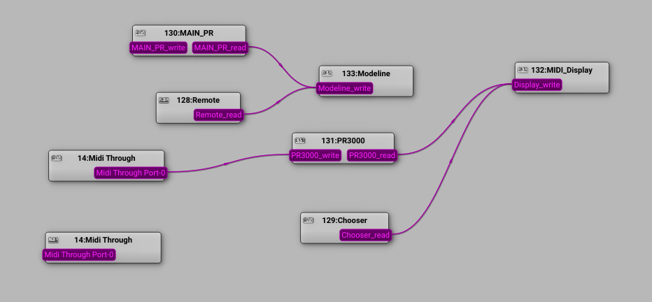

# MW21 - Music Workstation

## What is MW21
MW21 is a simple karaoke / stage-prompter application for singers and amateur music bands. It's able to playback music and display lyrics in four rows highlighting it in-sync to the music.

Video tutorials: [https://www.youtube.com/@mk-1037](https://www.youtube.com/@mk-1037)

It's designed to run on GNU/Linux operating system. Currently - installation scripts are designed for debian-based systems with `XFCE`/`Mate` desktop.

In fact - `MW21` is a bundle of applications and scripts communicating  via `alsa` midi and inter-process communications (signals).
It is controlled via any physical MIDI device (keyboard, pad, launcher, whatever ...) or application e.g. `vkeybd` for Linux.

It also integrates through `php`/`shell` scripts with `apache2` server. It offers simple web-based playlist for playback music through e.g. breaks during your performance. It's convenient for controlling music player with your mobile phone staying connected in LAN.

## Concept
The basic idea behind is simultaneous playback of an audio file (wav or mp3) and a midi file (with adjustable `delay` of audio __following__ midi). Midi events emitted from the midi player are forwarded to the `display` program which advances pointer of the highlighted text. It works quite well :-)

## Implementation
Window library is `gtkmm-3.0`
Playback backend is `VLC` (well-known multimedia player). This system supports playback of wav and mp3 files.
Text rendering is implemented with `freetype2` library.
MIDI sequencing - `pmidi` (command line midi player).
Scripts for placing windows is `wmctrl` - it relies on `X11`

## Data format
Creating text for karaoke is easy. It is enough to write regular plain-text file (tokens separated with `|` or newline, hint lines starting with `~`). Synchronization to the music is a separate thing. It's not a piece of cake and basic MIDI-sequencer experience is needed. Basically - you need to create a midi file with the same length as your audio file.

Note C#-2 with velocity 1 at channel 4 is advancing the pointer of highlighted text. Note A-2 on the same channel/velocity re-winds text to the beginning.
Some documentation on this - planned to be provided soon.

## Installation
For the __easiest installation__ `MW21` should be placed directly in your home directory. You simply run:

    cd ~/
    git clone http://github.com/mk1037/MW21
    cd ~/MW21/
    ./installMW21.sh

This script was tested at Linux Lite 7.2 but should work for many debian-based distributions.

If you decide to run apache2 server, please remember that it must be run as regular user (not `www-data` user). It's definitely __not_recommended__ for real web servers (public-available), but for this application (running only for few hours in local network) should be fine.

Please remember to publish `mw21/web` directory via your `apache2` web server.

## Data setup
To download and install some __example tracks__ just do:

    cd ~/MW21/
    ./exampleTracks.sh

You are ready to run `MW21` and play !

Files will be placed in karaoke directory with the structure below:

    karaoke/
    `-- bank_3/
        |-- delay/
        |-- midi/
        |-- text/
        `-- waves/

to be scanned correctly via `modeline` program.

__Optionally__

Collection of files to be played during breaks must be placed in some directory with prefixes:

    0000_abcxyz.mp3
    0001_abcxyz.mp3
    .
    .
    .
    xxx9_abcxyz.mp3

The total number must be divisible by 10 e.g. 10, 20, 30, 70, 150 etc...
Prefix must be 4-digits with leading zeros. Only ASCII, no-spaces allowed.

## Running and playing songs
Right after installation - before first run of MW21 it's recommended to start VLC player (with GUI) and simply close it. The reason is to initialize some VLC config files.

Run `MW21` by executing:

    cd ~/MW21/mw21/web/
    ./run_mw21.sh

This runs all components as a processes in dedicated terminals, makes midi connections via `aconnect` and places windows in virtual desktops according to coordinates defined in `MW21/mw21/config/default/specific_variables.sh`
You need to have at least 3 virtual desktops in your `Mate`/`XFCE` dsktop environment.

Depending on your graphical environment and installed terminal - you may need to adjust the variable `TERMINAL_BIN` in `MW21/mw21/config/default/specific_variables.sh`

The entry point for entire system is `Main proxy` referenced in short by label:

    MAIN_PR

Once started, you can check the connections graph with command:

    aconnect -l

This should show you something like:

Visualisation of connections graph shown below:

Now - we want to choose songs, load them and play in `MW21`

One possible way is to run `vkeybd` application and connect it to `MAIN_PR`.

Open a new console and type:

    vkeybd

When started, open another console and connect it to the `MAIN_PR` with command:

    aconnect 'Virtual Keyboard':0 'MAIN_PR':0

or alternatively (in this case)

    aconnect 134:0 130:0

Now it's connected:

In `vkeybd` set `Key`: 60 and `Velocity`: 127

Operate `MW21` by pressing keys.

White key jumps to char.

Lower octave:

__C# - previous char__

__D# - previous song__

__F# - next song__

__G# - next song__

__A# - next char__

Middle octave:

__C# - stop__

__F# - load__

__G# - play__

Instead of virtual keyboard you can use physical MIDI device on the stage. Possibly some event mapping is needed. All events accepted by `modeline` are defined in `MW21/mw21/modeline/midiclient.h`
Still - the entry point is `MAIN_PR` which may filter out some events.

Many things need to be improved and optimized in this system. Speed of rendering text is one of those. There are possible lags when running `display` application in higher resolutions. For now the best performance you will achieve setting `areaWidth` width to less or equal 800 pixels (file `MW21/mw21/configs/default/mw2_config`).

In fact - higher resolution is not needed for this type of application. Having big display (around 20 inches) you can still clearly see it even from few meters. Setting your display resolution to something like __800x600__ (like in the first picture) or __720x400__ or __720x405__ is recommended.

Have fun!

mk1037

